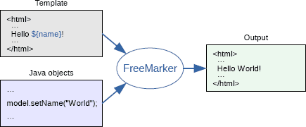

这是关于springboot支持的模板引擎freemarker的学习博客
[中文文档](http://freemarker.foofun.cn/toc.html)

## 官网对freemarker的介绍
>  模板 + 引擎 = 输出
    

### 模板
实际上用程序语言编写的程序就是模板。 FTL (代表FreeMarker模板语言)。 这是为编写模板设计的非常简单的编程语言。

模板(FTL编程)是由如下部分混合而成的：

   

 - 文本：文本会照着原样来输出。
 - 插值：这部分的输出会被计算的值来替换。插值由 ${ and } 所分隔(或者 #{ and }，这种风格已经不建议再使用了；
 - FTL 标签：FTL标签和HTML标签很相似，但是它们却是给FreeMarker的指示， 而且不会打印在输出内容中。
 - 注释：注释和HTML的注释也很相似，但它们是由 <#-- 和 -->来分隔的。注释会被FreeMarker直接忽略， 更不会在输出内容中显示。
   
### demo

``` javascript
<html>
<head>
  <title>Welcome!</title>
</head>
<body>
  <#-- Greet the user with his/her name -->
  <h1>Welcome ${user}!</h1>
  <p>We have these animals:
  <ul>
  <#list animals as animal>
    <li>${animal.name} for ${animal.price} Euros
  </#list>
  </ul>
</body>
</html>
```
>FTL是区分大小写的。 list 是指令的名称而 List 就不是。类似地 ${name} 和 ${Name} 或 ${NAME} 也是不同的。请注意非常重要的一点： 插值 仅仅可以在 文本 中使用。 (也可以是字符串表达式；请参考 后续内容)FTL 标签 不可以在其他 FTL 标签 和 插值中使用。比如， 这样做是 错误 的： <#if <#include 'foo'>='bar'>...</#if>注释 可以放在 FTL 标签 和 插值中。

## 模板引擎(结合springboot)

### 在springboot中集成freemarker

 - 所需要的maven依赖
   

``` java
        <dependency>
            <groupId>org.springframework.boot</groupId>
            <artifactId>spring-boot-starter-freemarker</artifactId>
        </dependency>
```

 - 配置信息

``` javascript
## Freemarker 配置
##模版存放路径（默认为 classpath:/templates/）
spring.freemarker.template-loader-path=classpath:/templates/
##是否生成缓存，生成环境建议开启（默认为true）
spring.freemarker.cache=false
##编码
spring.freemarker.charset=UTF-8
spring.freemarker.check-template-location=true
##content-type类型(默认为test/html)
spring.freemarker.content-type=text/html
## 设定所有request的属性在merge到模板的时候，是否要都添加到model中（默认为false）
spring.freemarker.expose-request-attributes=false
##设定所有HttpSession的属性在merge到模板的时候，是否要都添加到model中.(默认为false)
spring.freemarker.expose-session-attributes=false
##RequestContext属性的名称（默认为-）
spring.freemarker.request-context-attribute=request
##模板后缀(默认为.ftl)
spring.freemarker.suffix=.html

```

- 先modelAndView中写入输入，flt模板文件一般存在template/freemarker中

>方法一   使用ModelMap
``` java
 @RequestMapping("/index")
    public String index(ModelMap modelMap){
        Map map = db.dbSources();
        modelMap.put("map",map);
        return "freemarker/index";
		}
```

> 方法二  使用ModelAndView，注意的是不能在接受参数时，直接传入modelAndView，没有绑定到模板，会产生错误

``` java
@RequestMapp
{
    public ModelAndView index(HttpServletRequest request){
        ModelAndView modelAndView = new ModelAndView("/freemarker/index");
        Map map = db.dbSources();
        modelAndView.addObject("map",map);
        return modelAndView;
		}
```

>方法三 使用model
	

``` java
 @RequestMapping("/index")
    public String index(Model model){
        Map map = db.dbSources();
        model.addAttribute("map",map);
        return "freemarker/index";

```

>总结，使用model和modelMap都可以，直接加入数据，然后重定向到页面，使用modelandview不行，必须进行绑定


### 数据的读取

##### 读取数据的方式

 - 指令
 - 表达式
 - 差值
  [详细命令见官方文档](http://freemarker.foofun.cn/dgui_template.html)
  
  
  #### 常见的遍历方式
  
 - 遍历map结构
  >map的键尽量是字符串或者数字类型：
  ><#if map?exists>
       <#list map?keys as key> 
              ${key}---${map[key]}
       </#list>
</#if>
 - 遍历list结构
  ><#list userList as user>
	用户名：${user.userName}
	密  码：${user.userPassword}
	年  龄: ${user.age}
</#list>
