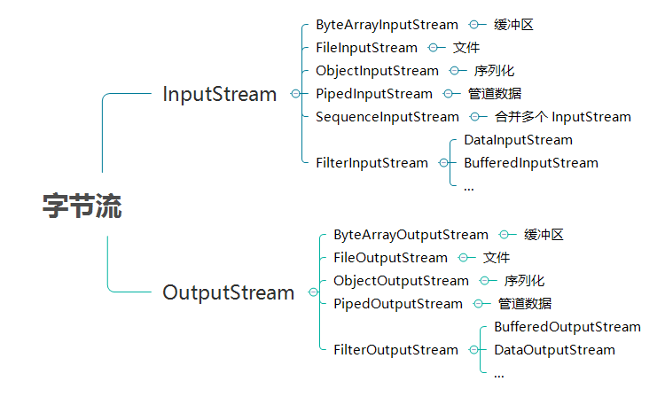

这是关于java基础中的io流的学习博客
[参考博客](https://baijiahao.baidu.com/s?id=1600984799323133994&wfr=spider&for=pc)
[参考博客二](https://github.com/dunwu/javacore/blob/master/docs/io/java-io.md)

## 传统IO流——BIO

BIO 中操作的流主要有两大类，字节流和字符流，两类根据流的方向都可以分为输入流和输出流。


* 字节流
    >输入字节流：InputStream
    输出字节流：OutputStream

 * 字符流
   > 输入字符流：Reader
    输出字符流：Writer


## 字节流
字节流主要操作字节数据或二进制对象。

字节流有两个核心抽象类：InputStream 和 OutputStream。所有的字节流类都继承自这两个抽象类。




### 文件字节流
FileOutputStream 和 FileInputStream 提供了读写字节到文件的能力。

文件流操作一般步骤：

 1. 使用 File 类绑定一个文件。
 2. 把 File 对象绑定到流对象上。
 3. 进行读或写操作。
 4. 关闭流


## FileInputStream的api

* 构造方法
  >//通过打开一个到实际文件的连接来创建一个 FileInputStream，该文件通过文件系统中的 File 对象 file 指定。
public FileInputStream(File file);
//通过打开一个到实际文件的连接来创建一个 FileInputStream，该文件通过文件系统中的路径名 name 指定。
public FileInputStream(String name);


## 读取文件的三种方式
* 从输入流中读取一个字节大小的数据
  > //从此输入流中读取一个数据字节。
public int read();

* 从输入流一次读取一个字节数组
  >//从此输入流中将最多 b.length 个字节的数据读入一个 byte 数组中。
public int read(byte[] b);


* 指定被读取文件的len长字节数据，偏移off个字节的长度，读入到字符数组中
  >//从此输入流中将最多 len 个字节的数据读入一个 byte 数组中。off:目标数组 b 中的起始偏移量。
public int read(byte[] b,int off,int len);

### demo
>第一种方式
``` java
// 一般使用try catch捕获异常，并且在finally中关闭文件流
public static void read(String filePath) throws IOException {
        int size = 0;
        File file = new File(filePath);
        InputStream inputStream = new FileInputStream(file);
        byte[] bytes = new byte[(int) file.length()];
        inputStream.read(bytes);
        System.out.println(new String(bytes));
    }
```
>第二种方式

``` java

 public static void read(String filePath) throws IOException {
        int a = 0;
        File file = new File(filePath);
        InputStream inputStream = new FileInputStream(file);
        while ((a=inputStream.read())!= -1){
            System.out.print((char) a);
        }
    }
```
>第三种方式

``` java
  public static void read(String filePath) throws IOException {
            int size = 0;
            File file = new File(filePath);
            InputStream inputStream = new FileInputStream(file);
            byte[] buffer = new byte[1024];
            while ((size=inputStream.read(buffer))!= -1){
                String context = new String(buffer, 0, size);
                System.out.println(context);
            }
```

## FileOutputStream的构造方法
>//通过打开一个到实际文件的连接来创建一个 FileoutputStream，该文件通过文件系统中的 File 对象 file 指定。
public FileoutputStream(File file);
//通过打开一个到实际文件的连接来创建一个 FileoutputStream，该文件通过文件系统中的路径名 name 指定。
public FileoutputStream(String name);

>public FileoutputStream(File file,boolean append);
>public FileoutputStream(String name,boolean append);
>append 为 True时，对文件内容进行追加操作

### FileoutputStream写入文件方法

* 使用write(int b)方法写入文件
	  

``` java
public static void write(String filePath) throws IOException{
        FileOutputStream output = new FileOutputStream(filePath,true);
        String str = "cccc";
        for (int i = 0; i < str.length(); i++) {
            int s = (int)str.charAt(i);
            output.write(s);
        }

    }
```

* 使用write(byte[] b)方法写入文件。
  

``` java
public static void write(String filePath) throws IOException{
        FileOutputStream output = new FileOutputStream(filePath,true);
        String str = "cccc";
        output.write(str.getBytes());

    }
```

* 使用write(byte[] b,int off,int len)方法写入文件。
  >第一个参数为byte数组，第二个参数5是从byte数组的下标开始，第三个参数是写入的字节数

``` java
 public static void write(String filePath) throws IOException{
        FileOutputStream output = new FileOutputStream(filePath,true);
        String str = "ddddd";
        output.write(str.getBytes(),0,5);

    }
```

demo

``` java
public class FileStreamDemo {

    private static final String FILEPATH = "temp.log";

    public static void main(String[] args) throws Exception {
        write(FILEPATH);
        read(FILEPATH);
    }

    public static void write(String filepath) throws IOException {
        // 第1步、使用File类找到一个文件
        File f = new File(filepath);

        // 第2步、通过子类实例化父类对象
        OutputStream out = new FileOutputStream(f);
        // 实例化时，默认为覆盖原文件内容方式；如果添加true参数，则变为对原文件追加内容的方式。
        // OutputStream out = new FileOutputStream(f, true);

        // 第3步、进行写操作
        String str = "Hello World\n";
        byte[] bytes = str.getBytes();
        out.write(bytes);

        // 第4步、关闭输出流
        out.close();
    }

    public static void read(String filepath) throws IOException {
        // 第1步、使用File类找到一个文件
        File f = new File(filepath);

        // 第2步、通过子类实例化父类对象
        InputStream input = new FileInputStream(f);

        // 第3步、进行读操作
        // 有三种读取方式，体会其差异
        byte[] bytes = new byte[(int) f.length()];
        int len = input.read(bytes); // 读取内容
        System.out.println("读入数据的长度：" + len);

        // 第4步、关闭输入流
        input.close();
        System.out.println("内容为：\n" + new String(bytes));
    }

}
```

## 文件复制demo

``` java
public class copy_demo {
    public static void main(String[] args) {
        String dest = "F:\\myblogssm\\demo_copy.txt";
        String source = "F:\\myblogssm\\demo.txt";
        copyFile(dest,source);
    }

    public static void copyFile(String dest,String sour){
        File fdest = new File(dest);
        File fsour = new File(sour);
        if (!fsour.exists()){
            System.out.println("源文件不存在");
            return;
        }
        try {
            fdest.createNewFile();
            FileInputStream fis = new FileInputStream(fsour);
            FileOutputStream fos = new FileOutputStream(dest);
            byte[] bytes = new byte[(int) fsour.length()];
            fis.read(bytes);
            fos.write(bytes);
            fos.flush();

            fis.close();
            fos.close();
            System.out.println("复制成功");


        } catch (IOException e) {
            e.printStackTrace();
        }


    }
}
```