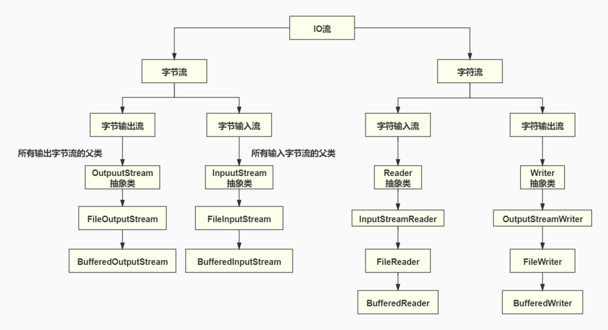

这是关于java基础中的io流的学习博客
[参考博客](https://mp.weixin.qq.com/s/AtYw_IufJnBjJDM-F6YIAA)
[参考博客二](https://github.com/dunwu/javacore/blob/master/docs/io/java-io.md)

## java读写文件的分类


   


## 字节流与字符流差异


>中文和英文在字符编码上存在一定性的差异，因为最开始使用的 ASCII编码表 的 256 个字符并没有支持中文，中文编码系统大多数采用的是 GBK 和 UTF-8 。


>在 GBK 编码表中，一个中文字符占用两个字节，UTF-8 中占用了 3 个字节，如果我们采用字节读写的方式读写中文字符就会出现中文编程乱码的情况， 我们都知道 Java 这么风靡很大部分还是因为他的跨平台性，但如果连语言都没有搞定那还怎么牛逼起来，所以 java 为了避免这种情况引进了字符的读写操作。


## 字符流操作

> Writer 是一个用于写入字符流的 「抽象类」。子类必须实现的方法仅有 write(char[], int, int)、flush() 和 close()。它是所有字符输出流的父类

### wirter常用方法

``` java
//写入一个字符
void write(int c)

//写入一个字符数组
void write(char[] cbuf)

//写入字符串
void write(String str)

//写入字符数组的一部分,从off索引开始,写入len个字符
void write(char[] cbuf, int off, int len)
```

wirter是抽象类，无法直接使用，所以我们使用它的直接子类FileWriter 

### FileWriter 的构造方法

``` java
/*覆盖形式写入，即从文件的开头进行写入*/

//根据给定的 File 对象构造一个 FileWriter 对象。
FileWriter(File file)   

//根据给定的文件名构造一个 FileWriter 对象。
FileWriter(String filename)   

/*追加形式的写入
  若传入的append参数是true则进行追加形式的写入，
  即从文件末尾写入*/
FileWriter(File file, boolean append)
FileWriter(String filename, boolean append)


```
它跟字符输入流的区别就是他会对磁盘文件进行操作，所以使用字符输出流的时候要注意有两个必须运行的方法：

``` javascript
//刷新该缓冲流，即 ，将使用的Wrtier流写入到本地文件中，而不是存于内存中
void flush()   

//关闭流，并且释放资源，但必须先刷新流         
void close()      
```

## 通过代码来学习字符输出流

``` javascript
 public static void main(String[] args) {
        String FilePath = "F:\\myblogssm\\FileWriter_demo.txt";
        try {
            FileWriter fw = new FileWriter(FilePath);
            fw.write(100);
            fw.flush();

            char[] cbuf = {'h','e','l','l','o'};
            fw.write(cbuf);
			fw.flush();

            fw.write("学习FileWriter");
            fw.flush();

            fw.write("你好，世界",0,2);
            fw.flush();
            
            fw.close();

        } catch (IOException e) {
            e.printStackTrace();
        }
    }
```

## 字符输入流Reader

> 「Reader」是一个用于读取字符流的「抽象类」。子类必须实现的方法只有 read(char[], int, int) 和 close()。
它是所有字符输入流的父类。
以下是 Reader 类中常用的几个方法:

``` javascript
/*返回值用于存放读取结果，如果到达文件末尾，则返回-1*/

//读取单个字符。
int read()

//将字符读入数组。 
int read(char[] cbuf)

//将字符读入数组的某一部分。 
int read(char[] cbuf, int off, int len)
```

同样的，由于Reader是一个抽象类,我们并不能直接的使用他,所以要找出Reader的子类。

在java中有一个Reader的直接子类 FileReader, 它的的 read 方法都继承自 Reader ；所以我们不必再去研究 FileReader 中的方法, 只需要把重心放到 FileReader 的构造方法中。

* FileReader 的构造方法
  >//在给定从中读取数据的 File 的情况下创建一个新 FileReader。
FileReader(File file)
//在给定从中读取数据的文件名的情况下创建一个新 FileReader。
FileReader(String fileName)


## 读取文件的demo
>第一种方式
```  
try {
            FileReader fr = new FileReader("F:\\myblogssm\\FileWriter_demo.txt");
            int len = 0;
            while ((len=fr.read())!= -1){
                System.out.print((char) len);
            }

        } catch (IOException e) {
            e.printStackTrace();
        }
```

>第二种方式

``` javascript
 try {
            FileReader fr = new FileReader("F:\\myblogssm\\FileWriter_demo.txt");
            char[] cbuf = new char[1024];
            fr.read(cbuf);
            for (char c : cbuf) {
                System.out.print(c);
            }

        } catch (IOException e) {
            e.printStackTrace();
        }
```

总结：字节流写入读取文件使用的缓存区是字节数组，字符流的缓冲区是字符数组
字节每次操作的单位是一个字节，字符流每次操作的单位是字符